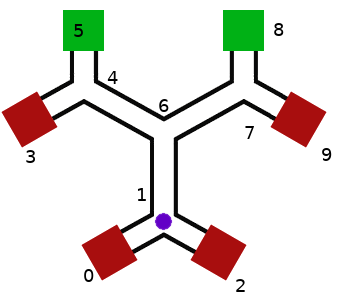

# Maze + big maze

A purple dot is at the position shown in the figure below. Every second it will move at random along one of its adjacent "roads" (the edges of the graph). Once it has reached either a green or a red square it stops. As we can see, at every incidence point it has 3 options. What is the probability that it will eventually end in one of the green squares?

## Run

* Create a virtual environment `virtualenv env` and activate `source env/bin/activate`.
* Install dependencies `pip3 install -r requirements.txt`
* Run code for 10 million iterations `python3 ./random-walk-graph.py`

## Solution

This assumes a random choice from a uniform distribution is being made at every intersection. Probability of reaching green is `0.111036211104` or `(1/9)`.

### Alternative solution.

If we consider the node at the symmetry of graph, i.e., the node above the purple point then there are 6 possible outcomes for the maze to terminate. 4 red nodes and 2 successful green nodes. From the point of symmetry, for the maze to successfully terminate, the probability is 2/6 or 1/3. However, the purple point is not at the point of symmetry and for it to reach the point of symmetry from its current location is 1/3 (it has 2/3 chance of reaching the red nodes, which will terminate the maze). Hence, the probability of the purple point reaching the green nodes is 1/3 * 1/3, which is 1/9.
